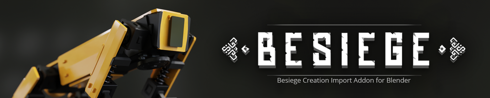

 

# Besiege Creation Import Addon for Blender

This is an addon for Blender to import Besiege Creations. Currently it works for Blender 2.90.1. I'm not sure if it works on older versions of Blender. I've had some people report issues with rotation of certain blocks on Blender 2.8, But I haven't tested it.

> **Note:** All models are imported from the Besiege game data directory and steam workshop folder, so its highly recommended that you get a copy of the game from Steam. 

### Installation
You can download a build from the [releases](https://github.com/arkangel-dev/BesiegeCreationImporter/releases), go to Blender `>` Top Bar `>` Edit `>` Add-ons `>` Install and navigate to the downloaded file. Then you can enable the addon from the Preferences window. If you want to install the addon from the current commit, you can open the files `__init__.py`, `bsgreader.py` and `blenapi.py` and set the variable `dev_mode` to False. You can find the variable at the beginning of each file. Then you can zip it all up and install

> **Note :** The latest commit not work correctly or might not even register properly. 

### Usage

1. Download and install the addon

2. Once installed you'll see a new tab called Besiege in the 3D viewport toolbar (Press N). Expand the settings section and you'll find 3 fields. `Game Folder`, `Workshop Folder` and `Backup Folder`.
   - Game folder is the Skins directory that is located in the `Besiege_Data` directory. 
   - Workshop folder is the workshop content directory for Besiege.
   - Backup is the skin pack to use in case the addon failed to find a skin specified in the BSG file. By default its set to the Template skin that is packed with Besiege.
   - You can now click `Save Global Configuration` to save this configuration globally, as in the configuration will persist with new Blend files
   
3. When importing you'll have a few options

   - **Create Parent:** If checked, all the blocks will be parented to an empty after importing
   - **Merge decor components:** If checked, the addon will join the decorative components with the base components. For example, if checked the needles on logic blocks will be joined with the mesh of the actual logic blocks.
   - **Use vanilla blocks:** If checked the addon will ignore all skin definitions from the BSG file and use the Template skin instead

   - **Generate Materials:** If not checked, materials will not be generated for the block. 
   - **Use node groups for materials:** If checked the addon will use node groups in the materials
   - **Grouping Method:** This will define how the node groups will be assigned. The node group can be assigned to all blocks, blocks by type or blocks by skin.
   - **Delete Threshold**: Defines the minimum distance between the start and end point of a line type before the end point and connector gets deleted (`Needs to be tuned`) Note that this applies to other line type objects
   - **Join components**: This applies to line type objects. If checked, their components will be joined into a single mesh
   - **Cleanup Action:** This defines how line type objects parents will be processed. You can delete the parents, hide the parents or do nothing.

4. Select a BSG file with the field labelled `BSG File`.

   > **Note:**  You'll notice a label called `Block Count`. This shows how many blocks are going to be imported. Also might notice a label called `Skipped Count` with some BSG files. These come from blocks that cannot be imported. Blocks such as cameras and mod blocks.

5. Click import

   > **Note:** If you get an error message when trying to import, please check that the file paths are configured correctly and they are accessible by Blender. If you think this is not the cause of the issue, please [create a new issue](https://github.com/arkangel-dev/BesiegeCreationImporter/issues/new/choose) in the repository

6. Hope everything imported correctly

### Things that are not supported yet

- Surface blocks
- Short wooden poles and blocks